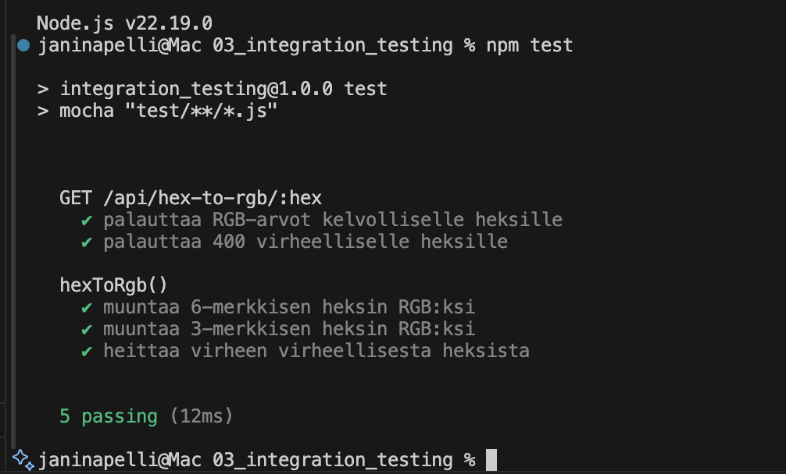
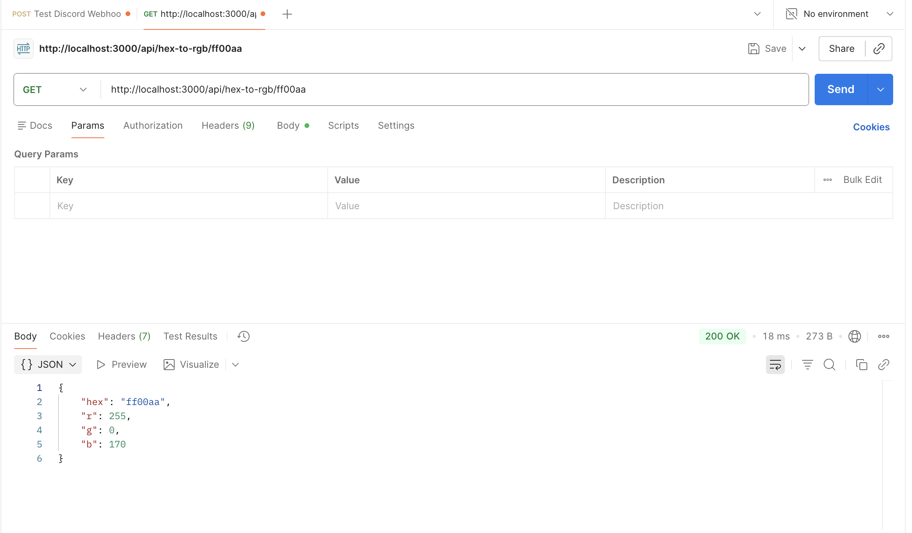

# 03_Integration_Testing

Express REST API hex-to-rgb -muunnokselle, yksikkotestit ja integraatiotestit.

## Tavoite
Toteutettiin REST API, joka muuntaa heksavarin RGB-arvoiksi. Lisaksi tehtiin yksikkotestit muunnoslogiikalle ja integraatiotestit HTTP-reitille.

## Toteutus
- Muunnoslogiikka: `src/hexToRgb.js`
- REST API -reitti: `src/app.js` (GET `/api/hex-to-rgb/:hex`)
- Yksikkotestit: `test/unit/hexToRgb.test.js`
- Integraatiotestit: `test/integration/hexRoute.test.js`
  
Logiikan erottaminen tekee koodista testattavan ja uudelleenkaytettavan. Integraatiotesti varmistaa, etta HTTP-reitti ja muunnoslogiikka toimivat oikein yhdessa.

## Projektin rakenne
- `server.js` kaynnistaa Express-sovelluksen (portti 3000 oletuksena).
- `src/app.js` sisaltaa REST API -reitin ja virhekasittelyn.
- `src/hexToRgb.js` sisaltaa muunnoslogiikan ja validoinnin.
- `test/unit/hexToRgb.test.js` testaa muunnoslogiikan (unit).
- `test/integration/hexRoute.test.js` testaa reitin toiminnan (integration).
- `rest-client.http` sisaltaa valmiit REST Client -pyynnot.
- `package.json` sisaltaa skriptit ja riippuvuudet.
- `.gitignore` estaa `node_modules`, `.env` ja `.DS_Store` -tiedostot.

## Kayttoohjeet
Asennus:
```bash
npm install
```

Kaynnistys:
```bash
npm start
```

Testit:
```bash
npm test
```


## API
Reitti:
```
GET /api/hex-to-rgb/:hex
```

Esimerkki:
```
GET http://localhost:3000/api/hex-to-rgb/ff00aa
```

Vastaus:
```json
{ "hex": "ff00aa", "r": 255, "g": 0, "b": 170 }
```

Virheellinen heksi:
```json
{ "error": "InvalidHex" }
```

## REST-testaus
Voit testata REST API:n Postmanilla tai REST Clientilla.

Postman-esimerkki:
1. Kaynnista palvelin: `npm start`
2. Luo uusi `GET`-pyynto
3. Kutsu: `http://localhost:3000/api/hex-to-rgb/ff00aa`
4. Odotettu vastaus: `200 OK` ja `{ "hex": "ff00aa", "r": 255, "g": 0, "b": 170 }`
5. Virheellinen syote: `http://localhost:3000/api/hex-to-rgb/zzzzzz`
6. Odotettu vastaus: `400` ja `{ "error": "InvalidHex" }`

