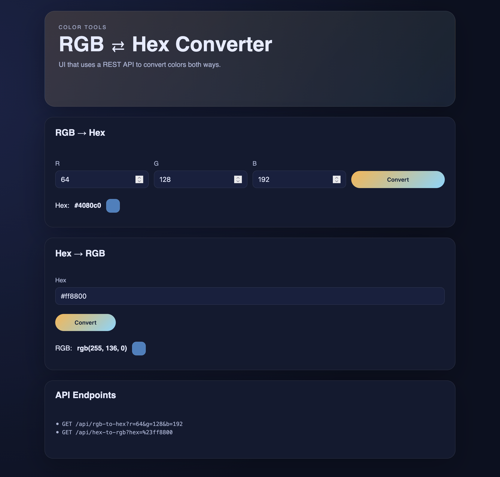

# RGB ⇄ Hex Converter — Testiraportti

## Kuvaus
Pieni web‑käyttöliittymä, joka käyttää REST‑API:a muuntamaan värejä RGB ↔ Hex.

## Kuvakaappaus
Sovelluksen kuvakaappaus

## Testausmenetelmät
- Manuaaliset UI‑testit selaimessa
- API‑smoketestit `curl`‑kutsuilla

## Testitulokset
### Manuaalitestit
- RGB → Hex: PASS (Tulos: `#4080c0` | Huomiot: sama kuin odotettu | Selain: Firefox | Päivä: 2026-02-10)
- Hex → RGB: PASS (Tulos: `rgb(255, 136, 0)` | Huomiot: sama kuin odotettu | Selain: Firefox | Päivä: 2026-02-10)
- Validointi (RGB): PASS (Tulos: selain esti lähetyksen arvolla R=300 ja näytti oman virheilmoituksen | Huomiot: HTML5‑validointi | Selain: Firefox | Päivä: 2026-02-10)
- Validointi (Hex): PASS (Tulos: API palautti 400 arvolla `abc` | Huomiot: UI näytti `rgb(undefined, undefined, undefined)` | Selain: Firefox | Päivä: 2026-02-10)

### API‑smoketestit
- `/api/rgb-to-hex` arvoilla `r=64 g=128 b=192`: PASS (ajettu 2026-02-10, serveri portissa 3001)
- `/api/hex-to-rgb` arvolla `#ff8800`: PASS (ajettu 2026-02-10, serveri portissa 3001)

### Lisä‑API‑testit
- RGB rajat: `r=0 g=0 b=0` → `#000000` (HTTP 200) PASS
- RGB rajat: `r=255 g=255 b=255` → `#ffffff` (HTTP 200) PASS
- RGB yli rajojen: `r=-1 g=0 b=0` → muuttui `#000000` (HTTP 200) PASS
- RGB yli rajojen: `r=256 g=0 b=0` → muuttui `#ff0000` (HTTP 200) PASS
- RGB väärä tyyppi: `r=abc g=0 b=0` → virhe (HTTP 400) PASS
- Hex rajat: `#000000` → `rgb(0,0,0)` (HTTP 200) PASS
- Hex rajat: `#ffffff` → `rgb(255,255,255)` (HTTP 200) PASS
- Hex isot kirjaimet: `FF8800` → `rgb(255,136,0)` (HTTP 200) PASS
- Hex väärä pituus: `fff` → virhe (HTTP 400) PASS
- Hex väärä pituus: `#00000` → virhe (HTTP 400) PASS
- Hex väärät merkit: `abc` → virhe (HTTP 400) PASS

## Löydökset
- UI ei käsittele Hex‑virhettä siististi: 400‑vastauksen jälkeen tulokseksi tulee `rgb(undefined, undefined, undefined)` ja värilaatikko ei muutu. Toisto: kirjoita `abc` ja paina Convert kohdassa Hex → RGB. (Firefox, 2026-02-10)
- API muuttaa RGB‑arvot rajojen sisään, eikä palauta odotettua 400‑virhettä. Esim. `r=-1` muuttuu `0` ja `r=256` muuttuu `255`.
