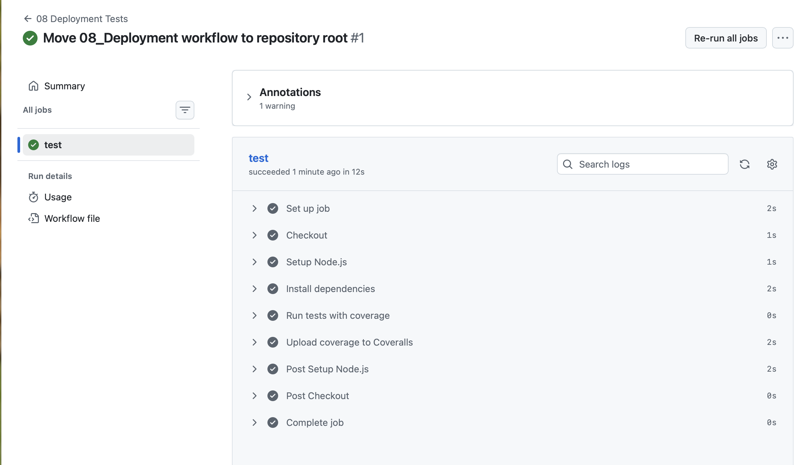
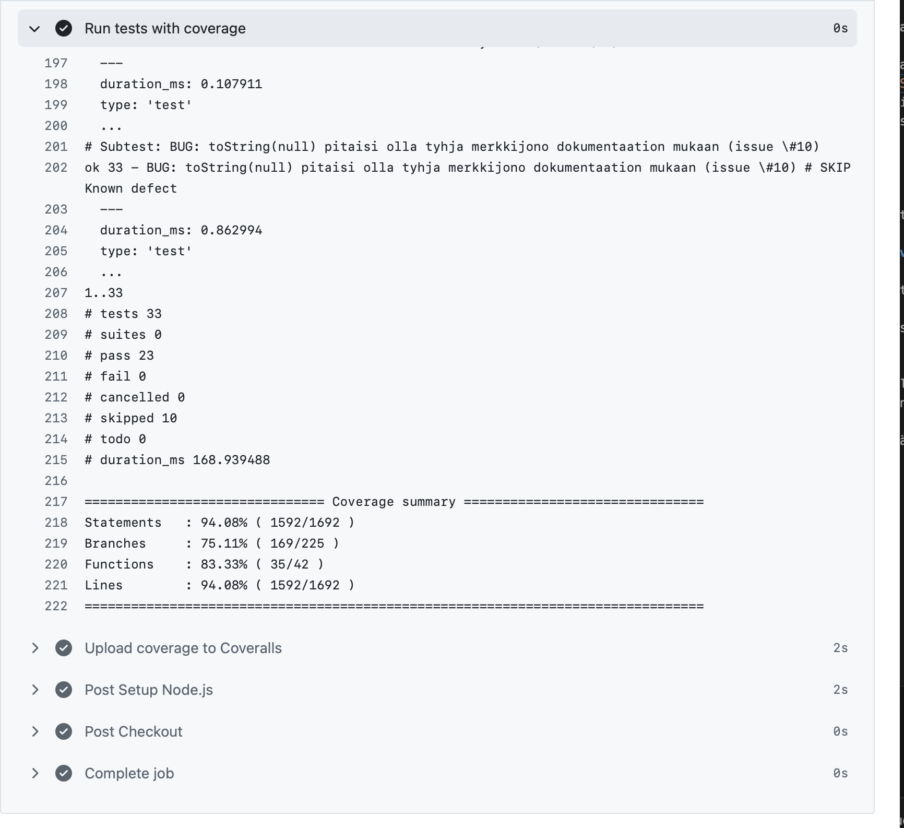
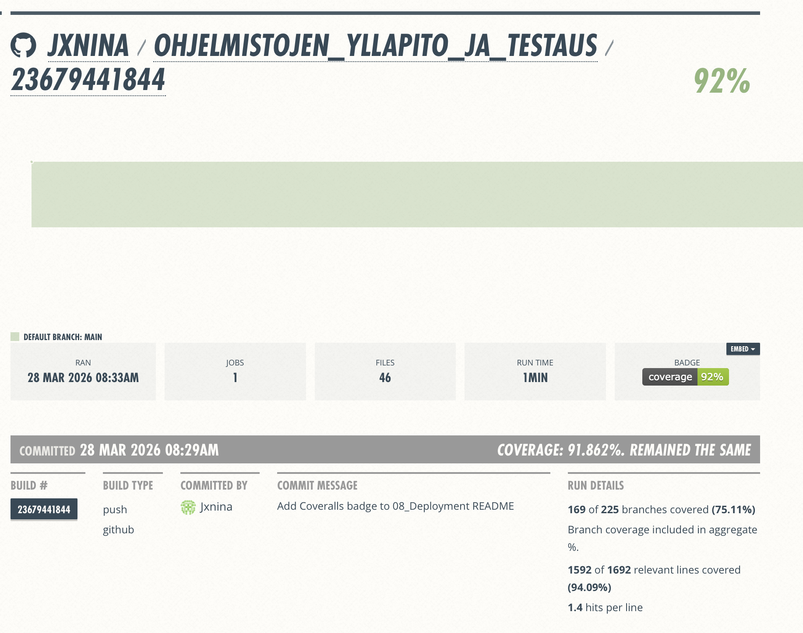
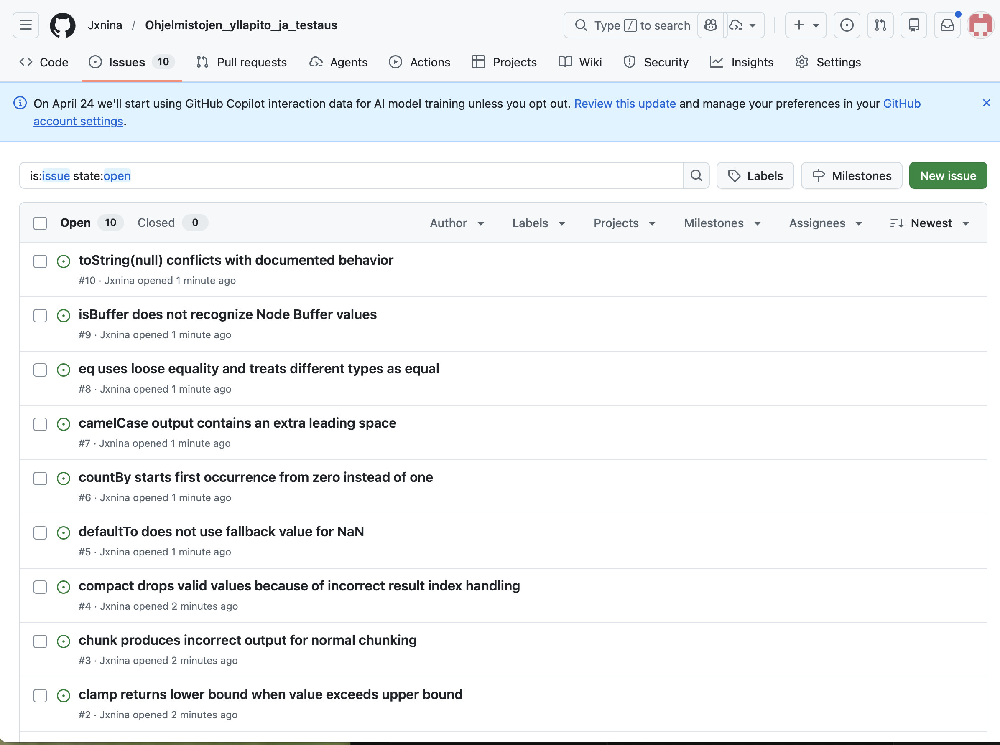

# AT00BY10-kirjaston testausraportti

## 1. Lähestymistapa

Tässä tehtävässä testasin annetun AT00BY10-kirjaston yksikkötesteillä. Testit toteutin Node.js:n omalla testirunnerilla (`node:test`) ja kattavuuden mittasin `c8`-työkalulla.

Tavoitteena oli:

- toteuttaa kirjastolle yksikkötestit
- saavuttaa vähintään 60 % kattavuus ilman `.internal`-kansiota
- rakentaa toimiva GitHub Actions -workflow
- lähettää kattavuusraportit Coverallsiin
- dokumentoida löydetyt virheet issue-raportteina

Jaoin testit kolmeen tiedostoon aihealueittain:

- `test/math-array.test.js`
- `test/object-collection.test.js`
- `test/string-func.test.js`

Testeissä on kaksi osaa:

1. läpipitävät yksikkötestit, joilla varmistetaan kirjaston tavallisia käyttötapauksia
2. skipatut bugitestit, jotka dokumentoivat testauksessa löydettyjä virheitä rikkomatta CI-putkea

Valitsin tämän ratkaisun siksi, että tehtävässä piti sekä toteuttaa toimiva testiputki että raportoida löydetyt ongelmat. Skipatut bugitestit näyttävät konkreettisesti, mitä kirjaston olisi odotettu tekevän, mutta mitä se ei nykyisellään tee oikein.

## 2. Ympäristö ja konfiguraatio

- Testattava kirjasto: `https://github.com/petri-rantanen/AT00BY10`
- Node.js: `v22.19.0`
- npm: `10.9.3`
- Testikomento: `npm test`
- Kattavuuskomento: `npm run test:coverage`
- Kattavuustyökalu: `c8`

Testauskonfiguraatio on määritelty `package.json`-tiedostossa. Kattavuusajo käyttää seuraavaa komentoa:

```bash
c8 --reporter=text-summary --reporter=lcov --exclude='src/.internal/**' --exclude='src/LICENSE' node --test
```

`.internal`-kansio on rajattu pois kattavuuslaskennasta tehtävänannon mukaisesti.

Lisäksi repossa on `.gitignore`, jossa on rajattu pois:

- `node_modules/`
- `coverage/`
- `.nyc_output/`
- `.DS_Store`
- `.env`

## 3. Yksikkötestien toteutus

Yksikkötestit kattavat kirjaston useita julkisia moduuleja. Testeissä tarkastetaan tavallisia käyttötapauksia sekä joitakin reunaehtoja.

### Testien rakenne

- `test/math-array.test.js`
  - array- ja math-funktiot
- `test/object-collection.test.js`
  - object-, collection- ja type check -funktiot
- `test/string-func.test.js`
  - string- ja function-funktiot

### Lokaalit testitulokset

Ajoin testit komennolla:

```bash
npm test
```

Tuloksena oli:

- testejä yhteensä: 33
- läpäistyjä: 23
- epäonnistuneita: 0
- skipattuja bugitestejä: 10

Skipatut testit dokumentoivat löydettyjä virheitä ainakin seuraavissa moduuleissa:

- `divide`
- `clamp`
- `chunk`
- `compact`
- `defaultTo`
- `countBy`
- `camelCase`
- `eq`
- `isBuffer`
- `toString`

## 4. Kattavuus

Kattavuus ajettiin komennolla:

```bash
npm run test:coverage
```

Lokaalisti saadut tulokset olivat seuraavat:

- Statements: `94.08 %`
- Branches: `75.11 %`
- Functions: `83.33 %`
- Lines: `94.08 %`

Kattavuus ylittää selvästi vähimmäisvaatimuksen `60 %`.

Kattavuusraportti muodostuu lokaalisti hakemistoon:

- `coverage/lcov.info`
- `coverage/lcov-report/`

## 5. GitHub Actions -putki

GitHub Actions -workflow on tiedostossa:

- `.github/workflows/08_deployment.yml`

Workflow käynnistyy tapahtumista:

- `push`
- `pull_request`

Putken vaiheet ovat:

1. Checkout (`actions/checkout@v4`)
2. Node.js-ympäristön asennus (`actions/setup-node@v4`, Node 22)
3. riippuvuuksien asennus komennolla `npm ci`
4. testien ja kattavuuden ajo komennolla `npm run test:coverage`
5. kattavuusraportin lähetys Coverallsiin (`coverallsapp/github-action@v2`)

Workflow täyttää tehtävänannon vaatimuksen: testit ja raportointi ajetaan automaattisesti, kun repositorioon pusketaan muutoksia.

Alla ovat kuvakaappaukset onnistuneesta workflow-ajosta sekä GitHub Actionsin testituloksista.





## 6. Coveralls-integraatio

Kattavuusraportin lähetys on konfiguroitu GitHub Actions -workflowhun käyttämällä GitHub Actionsin `GITHUB_TOKEN`-salaisuutta. Näin julkiseen repositorioon ei tarvitse tallentaa näkyviä tunnuksia tai tokeneita.

Workflow lähettää tiedoston:

- `coverage/lcov.info`

Coverallsiin.

Kuvakaappaus Coveralls-raportista:




## 7. Testatut ja testaamattomat tiedostot

### Testatut tiedostot

Seuraaville julkisille moduuleille on tehty vähintään perustason testejä:

- `src/add.js`
- `src/at.js`
- `src/camelCase.js`
- `src/capitalize.js`
- `src/castArray.js`
- `src/ceil.js`
- `src/chunk.js`
- `src/clamp.js`
- `src/compact.js`
- `src/countBy.js`
- `src/defaultTo.js`
- `src/defaultToAny.js`
- `src/difference.js`
- `src/divide.js`
- `src/drop.js`
- `src/endsWith.js`
- `src/eq.js`
- `src/every.js`
- `src/filter.js`
- `src/get.js`
- `src/isArguments.js`
- `src/isArrayLike.js`
- `src/isArrayLikeObject.js`
- `src/isBoolean.js`
- `src/isBuffer.js`
- `src/isDate.js`
- `src/isEmpty.js`
- `src/isLength.js`
- `src/isObject.js`
- `src/isObjectLike.js`
- `src/isSymbol.js`
- `src/isTypedArray.js`
- `src/keys.js`
- `src/map.js`
- `src/memoize.js`
- `src/reduce.js`
- `src/slice.js`
- `src/toFinite.js`
- `src/toInteger.js`
- `src/toNumber.js`
- `src/toString.js`
- `src/upperFirst.js`
- `src/words.js`

### Testaamattomat tiedostot

Seuraavat tiedostot tai tiedostoryhmät jäivät tarkoituksella testauksen ulkopuolelle:

- `src/.internal/*`
  - nämä on rajattu tehtävänannon mukaan testauksen ja kattavuusraportoinnin ulkopuolelle
- `src/LICENSE`
  - ei ole varsinainen testattava ohjelmamoduuli

Lisäksi kaikkia julkisia `src/`-hakemiston tiedostoja ei testattu erillisillä suorilla testeillä. Tässä ratkaisussa keskityin sellaisiin, jolla saavutettiin vaadittu kattavuustaso ja samalla löytyi selkeitä toiminnallisia virheitä.
 
## 8. Löydetyt virheet ja issue-raportit

Testauksen aikana löytyi useita loogisia ja toiminnallisia virheitä kirjaston julkisista API-funktioista. Näistä tein issue-ehdotukset tiedostoon:

- `docs/issues-to-report.md`

Raportoitavat löydökset koskevat ainakin seuraavia moduuleja:

- `src/divide.js`
- `src/clamp.js`
- `src/chunk.js`
- `src/compact.js`
- `src/defaultTo.js`
- `src/countBy.js`
- `src/camelCase.js`
- `src/eq.js`
- `src/isBuffer.js`
- `src/toString.js`

GitHub-issueiden linkit julkisessa repositoriossa:

- Issue 1: https://github.com/Jxnina/Ohjelmistojen_yllapito_ja_testaus/issues/1
- Issue 2: https://github.com/Jxnina/Ohjelmistojen_yllapito_ja_testaus/issues/2
- Issue 3: https://github.com/Jxnina/Ohjelmistojen_yllapito_ja_testaus/issues/3
- Issue 4: https://github.com/Jxnina/Ohjelmistojen_yllapito_ja_testaus/issues/4
- Issue 5: https://github.com/Jxnina/Ohjelmistojen_yllapito_ja_testaus/issues/5
- Issue 6: https://github.com/Jxnina/Ohjelmistojen_yllapito_ja_testaus/issues/6
- Issue 7: https://github.com/Jxnina/Ohjelmistojen_yllapito_ja_testaus/issues/7
- Issue 8: https://github.com/Jxnina/Ohjelmistojen_yllapito_ja_testaus/issues/8
- Issue 9: https://github.com/Jxnina/Ohjelmistojen_yllapito_ja_testaus/issues/9
- Issue 10: https://github.com/Jxnina/Ohjelmistojen_yllapito_ja_testaus/issues/10

Kuvakaappaus GitHubin issue-listasta:



## 9. Lopullinen arvio kirjastosta

Nykyisellä testikattavuudella ja löydetyillä virheillä kirjasto ei ole mielestäni valmis tuotantokäyttöön.

Perustelut:

- Julkisissa API-funktioissa löytyi useita selviä loogisia virheitä, esimerkiksi moduuleissa `divide`, `clamp`, `chunk` ja `compact`.
- Osa toteutuksista on ristiriidassa odotetun toiminnan tai dokumentoidun käytöksen kanssa, esimerkiksi `defaultTo`, `camelCase`, `eq` ja `toString`.
- Vaikka kattavuus on korkea, korkea kattavuus ei yksin riitä takaamaan laatua, jos testit paljastavat suoria toiminnallisia virheitä julkisissa rajapinnoissa.
- Osa kirjaston julkisista moduuleista jäi edelleen ilman erillisiä suoria testejä, joten kaikkia mahdollisia ongelmia ei ole vielä löydetty.

Yhteenvetona arvioisin, että kirjasto soveltuu tässä vaiheessa korkeintaan jatkokehityksen ja virheenkorjauksen kohteeksi, ei tuotantokäyttöön sellaisenaan.
